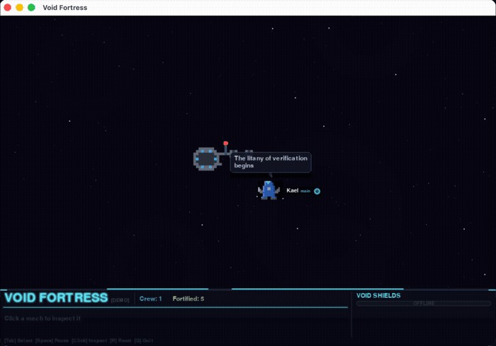

<p align="center">
  
</p>

<pre align="center">

 ██╗   ██╗ ██████╗ ██╗██████╗     ███████╗ ██████╗ ██████╗ ████████╗██████╗ ███████╗███████╗███████╗
 ██║   ██║██╔═══██╗██║██╔══██╗    ██╔════╝██╔═══██╗██╔══██╗╚══██╔══╝██╔══██╗██╔════╝██╔════╝██╔════╝
 ██║   ██║██║   ██║██║██║  ██║    █████╗  ██║   ██║██████╔╝   ██║   ██████╔╝█████╗  ███████╗███████╗
 ╚██╗ ██╔╝██║   ██║██║██║  ██║    ██╔══╝  ██║   ██║██╔══██╗   ██║   ██╔══██╗██╔══╝  ╚════██║╚════██║
  ╚████╔╝ ╚██████╔╝██║██████╔╝    ██║     ╚██████╔╝██║  ██║   ██║   ██║  ██║███████╗███████║███████║
   ╚═══╝   ╚═════╝ ╚═╝╚═════╝     ╚═╝      ╚═════╝ ╚═╝  ╚═╝   ╚═╝   ╚═╝  ╚═╝╚══════╝╚══════╝╚══════╝

                         ⚔ IN THE GRIM DARKNESS OF THE FAR FUTURE, THERE IS ONLY CODE ⚔

</pre>


<p align="center">
  <a href="#quick-start">Quick Start</a> &nbsp;&bull;&nbsp;
  <a href="#features">Features</a> &nbsp;&bull;&nbsp;
  <a href="#controls">Controls</a> &nbsp;&bull;&nbsp;
  <a href="#credits">Credits</a>
</p>

---

Your Claude Code agents are construction mechs building a space fortress in real-time. Every tool call forges another bulkhead. Every subagent deploys another battle-brother. Every error awakens the Necrons.

**Your fortress is unique. Your fortress is yours. And when context compacts — it crumbles.**

---

## Quick Start

```bash
curl -fsSL https://raw.githubusercontent.com/klietzau280/void-fortress/main/install-remote.sh | bash
```

Then run `void-fortress` (or `void-fortress --demo` to try without Claude Code).

<details>
<summary>Manual install</summary>

```bash
git clone https://github.com/klietzau280/void-fortress.git
cd void-fortress
./install.sh
python3 gui.py
```

</details>

<details>
<summary>Uninstall</summary>

```bash
./uninstall.sh
```

Removes the hooks from Claude Code. Your other settings are untouched.

</details>

---

## Features

| | |
|---|---|
| **Procedural fortress** | Grows as you code — Edit builds armory walls, Read deploys augur arrays, Bash lays plasma conduits, Grep raises sensor spires |
| **Context compaction** | When Claude Code compacts a session, every structure that agent built is **destroyed in explosive fashion** — the fortress crumbles |
| **Claw wrecker mechs** | Fly to build sites with thruster flames, weld with sparks. Session color-coded hull accents |
| **Void Shields** | Per-session fuel bars color-coded to each mech's hull — watch context drain in real-time |
| **Structure labels** | Hover any structure to see what it is and who built it |
| **Pilot dossiers** | Click a mech to inspect its battle-brother — Doom-style portrait, mood-glow frame, stats |
| **Necron incursions** | Errors awaken tomb world horrors: *"NECRON MONOLITH PHASING INTO THE REPO!"* |
| **Space radio comms** | Voice lines through bandpass filter with static crackle, like transmissions from a distant void ship |
| **Battle moods** | ZEALOUS when coding, WRATHFUL fixing bugs, GLORIOUS on completion, BESIEGED under attack |
| **150+ war thoughts** | *"The Codex Astartes supports this refactor"* ... *"git blame reveals... HERESY"* |
| **HUD polish** | Tech corners, scan lines, glow text, accent dividers — grimdark military holographic display |

---

## The Crew

<table>
  <tr>
    <td align="center"><br /><sub><b>ZEALOUS</b></sub></td>
    <td align="center"><br /><sub><b>WRATHFUL</b></sub></td>
    <td align="center"><br /><sub><b>GLORIOUS</b></sub></td>
    <td align="center"><br /><sub><b>BESIEGED</b></sub></td>
  </tr>
</table>

Doom-style pilot portraits. 56 unique battle-brothers. Visors glow with their current mood.

## The Mechs

<table>
  <tr>
    <td align="center"><br /><sub>Standing watch</sub></td>
    <td align="center"><br /><sub>Moving to target</sub></td>
    <td align="center"><br /><sub>Welding bulkheads</sub></td>
  </tr>
</table>

---

## Controls

| Key | Action |
|:---:|--------|
| **Click** | Inspect pilot dossier |
| **Hover** | Structure label (name + builder) |
| **Tab** | Cycle mechs |
| **Space** | Pause / resume |
| **R** | Purge and rebuild |
| **Q** | Disengage |

---

## What You Build Depends on How You Code

```
Claude Code Tool          Fortress Structure
─────────────────         ──────────────────────────────────────────
Edit / Write        -->   Armory, Barracks, War Chapel, Shield Generator
Read                -->   Lance Battery, Augur Array
Grep / Glob         -->   Sensor Spire, Lance Battery
Bash                -->   Plasma Conduit, Reactor
Agent spawn         -->   Armory, Shield Generator, Barracks
Context compact     -->   EVERYTHING EXPLODES
```

## Agent Behavior

| State | Behavior |
|-------|----------|
| Coding / Fixing / Testing | Mechs fly to the station and build |
| Reading / Searching / Thinking | Mechs orbit near the station |
| Idle / Waiting | Mechs retreat to the corner |
| Errors | Necron panic — tomb world signatures, gauss flayer hits |
| Context compaction | All structures built by that agent are destroyed |

---

## Requirements

- **macOS**
- **Python 3.9+**
- **pygame**
- **Claude Code**

## Credits

- **Voice** — [Sci-Fi Trooper Voice Pack](https://opengameart.org/content/sci-fi-trooper-voice-pack-54-lines) by Angus Macnaughton (CC-BY 4.0), processed through space radio filter
- **Portraits** — Procedural, inspired by Doom's STFST status bar sprites
- **Engine** — [pygame](https://www.pygame.org/)

---

<p align="center">
  <em>The Emperor protects. The Codex Astartes supports this action. The Necrons do not care.</em>
</p>
